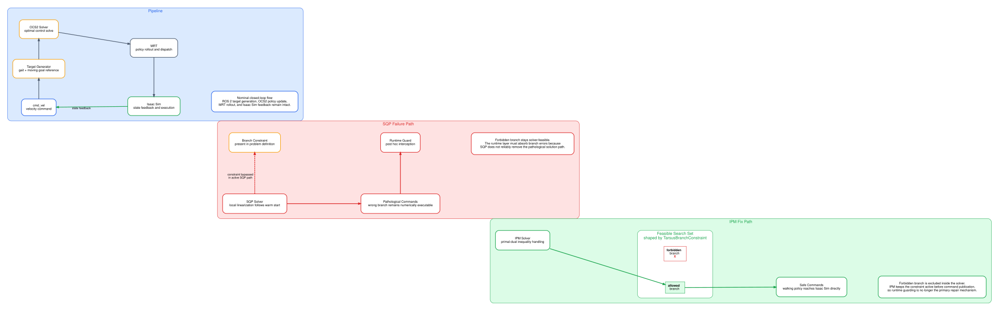
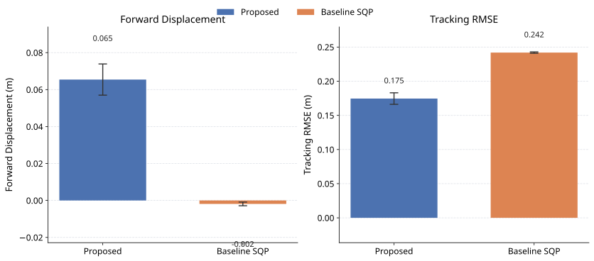
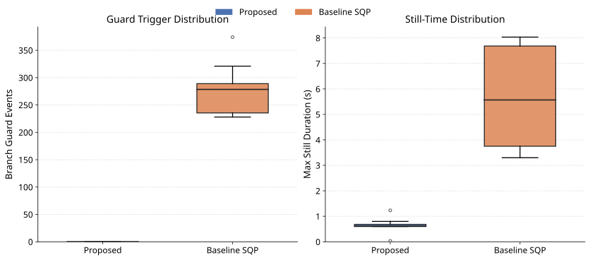
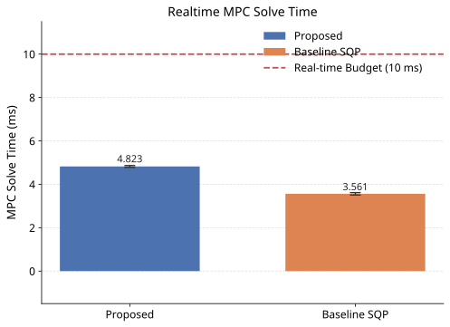

# 🕷️ Branch-Consistent MPC for Hexapod Locomotion

> 基于 ROS 2、OCS2 与 NVIDIA Isaac Sim 的六足机器人分支一致性模型预测控制项目，通过 Solver-Visible 约束抑制跗节运动学分支跳变，并验证实时 MPC 控制性能。

<p align="left">
  
  
  
  
  
  
</p>

## 🎬 项目演示

[](https://www.bilibili.com/video/BV1ji766QEMb/)

▶ **演示视频：**  
https://www.bilibili.com/video/BV1ji766QEMb/

> 视频展示内容均为 NVIDIA Isaac Sim 仿真实验，不代表实体六足机器人实测性能。

---

## 📖 项目简介

本项目研究 **六足机器人实时 MPC 中的运动学分支一致性问题**。

六足机器人腿部逆运动学可能存在多个关节构型。当优化器进入与实际机械结构不一致的跗节分支时，可能出现：

- 跗节分支跳变
- 异常腿部姿态
- 控制输出被 Runtime Guard 拒绝
- 机器人停滞或前进性能下降
- 状态跟踪误差增大

本项目将跗节分支合法性直接编码进最优控制问题：

```text
TarsusBranchConstraint
        +
Interior-Point Method (IPM)
```

使分支条件成为 **Solver-Visible Hard Constraint**，让优化器在求解阶段主动避开不符合机械结构的解。

---

## 💡 核心方法

### Baseline

```text
Solver: SQP
TarsusBranchConstraint: Disabled
```

主要依赖优化后的运行时保护逻辑处理异常分支。

### Proposed

```text
Solver: Interior-Point Method (IPM)
TarsusBranchConstraint: Enabled
```

将跗节左右分支的合法区域编码为状态不等式，使约束直接参与 MPC 求解。

核心实现：

```text
source_code/ocs2_hexbot_ws_src/
└── ocs2_hexbot_legged_robot/
    ├── include/ocs2_hexbot_legged_robot/constraint/
    │   └── TarsusBranchConstraint.h
    └── src/constraint/
        └── TarsusBranchConstraint.cpp
```

---

## 🧠 控制系统架构



```text
Motion Command
      ↓
Reference Manager
      ↓
Gait / Contact Schedule
      ↓
OCS2 MPC
 ├── Dynamics
 ├── Cost
 ├── State / Input Constraints
 └── TarsusBranchConstraint
      ↓
Interior-Point Method
      ↓
Optimal Solution
      ↓
Hexbot Controller
      ↓
ROS 2
      ↓
Isaac Sim
      ↓
State / Odom / Joint Feedback
      └──────────────→ MPC
```

项目形成了从 **机器人模型 → MPC 控制 → Isaac Sim 闭环仿真 → 数据采集 → 指标分析** 的完整验证链路。

---

## ✨ 核心内容

| 模块 | 实现内容 |
| --- | --- |
| 六足机器人模型 | Hexbot URDF / USD 与 Isaac Sim 资产 |
| MPC 控制器 | 基于 OCS2 的实时最优控制 |
| 分支一致性约束 | `TarsusBranchConstraint` |
| 求解器 | IPM / SQP 对照 |
| 步态控制 | Contact Schedule、Reference Manager |
| 仿真平台 | NVIDIA Isaac Sim 4.5.0 |
| ROS 2 | Jazzy、状态反馈、关节命令、TF / RViz |
| 批量实验 | Baseline / Proposed 重复实验 |
| 数据分析 | 位移、RMSE、Guard、Reject、求解时间等 |
| 结果复现 | 批处理、分析与绘图脚本 |

---

## 📊 实验结果

### 主要结果

| 指标 | Baseline | Proposed |
| --- | ---: | ---: |
| Branch Guard Events | 275.9 / run | **0.0 / run** |
| Tracking RMSE | 0.242 m | **0.175 m** |
| 平均 MPC 求解时间 | — | **4.82 ms** |
| 20 s 重复实验平均前进距离 | — | **0.306 m** |
| 20 s Guard / Reject | — | **0 / 0** |

60 秒耐久仿真记录：

```text
Forward displacement : 0.638 m
Yaw drift            : 8.27°
Body-height range    : 0.011 m
Average MPC solve    : 4.63 ms
```

上述结果均来自 **Isaac Sim 仿真实验**。

完整方法、实验协议与讨论：

- [English Technical Report](docs/manuscript/technical_report_en.pdf)
- [中文技术报告](docs/manuscript/technical_report_zh.pdf)

---

## 📈 结果可视化

### 前进位移与跟踪误差



### Branch Guard 与停滞时间



### MPC 求解时间



---

## 🛠 技术栈

**控制：**  
`OCS2` · `Model Predictive Control` · `Interior-Point Method` · `SQP`

**机器人：**  
`Hexapod Robot` · `Legged Locomotion` · `Inverse Kinematics` · `Gait Control`

**中间件：**  
`ROS 2 Jazzy` · `TF` · `RViz`

**仿真：**  
`NVIDIA Isaac Sim 4.5.0` · `USD` · `PhysX`

**开发与分析：**  
`C++` · `Python 3.10` · `Docker` · `Bash` · `NumPy` · `Pandas` · `Matplotlib`

---

## 📁 项目结构

```text
hexbot-branch-consistent-mpc/
│
├── source_code/
│   ├── ocs2_hexbot_ws_root/
│   │   └── 复现与容器运行脚本
│   │
│   ├── ocs2_hexbot_ws_src/
│   │   ├── hexbot_description_ros2/
│   │   ├── hexbot_isaac_runtime/
│   │   ├── hexbot_locomotion_mpc/
│   │   ├── hexbot_locomotion_v2/
│   │   ├── ocs2_hexbot_legged_robot/
│   │   └── ocs2_hexbot_legged_robot_ros/
│   │
│   └── hexbot_paper_icra_v1/
│       └── 中英文技术稿件与 LaTeX 源码
│
├── experiment_data/
│   ├── batch_metadata/
│   └── idle_reference_probe_json/
│
├── paper_figures_and_analysis/
│   ├── analysis_csv/
│   └── figures/
│
├── docs/
│   ├── ARCHIVE.md
│   └── manuscript/
│       ├── technical_report_en.pdf
│       └── technical_report_zh.pdf
│
├── .gitignore
└── README.md
```

> 为保持历史实验和脚本的相对路径有效，`source_code/`、`experiment_data/` 与 `paper_figures_and_analysis/` 的内部结构基本保留原研究环境布局。

---

## 🚀 复现入口

主要说明：

[README_PAPER.md](source_code/ocs2_hexbot_ws_root/README_PAPER.md)

主要脚本：

```text
source_code/ocs2_hexbot_ws_root/
└── reproduce_paper_results.sh

source_code/ocs2_hexbot_ws_src/
└── hexbot_locomotion_mpc/
    └── src/
        ├── run_experiments_batch.py
        ├── analyze_hexbot_metrics.py
        └── plot_hexbot_results.py
```

主要环境：

```text
Ubuntu 22.04
ROS 2 Jazzy
Python 3.10
Docker
NVIDIA Isaac Sim 4.5.0
```

部分历史脚本仍保留原开发路径：

```text
/home/u-zhuang/ros2_ws/src/ocs2_hexbot_ws
```

在其他环境复现时需要统一修改或映射该路径。

---

## 📄 技术报告

项目保留中英文技术报告：

- [English Technical Report](docs/manuscript/technical_report_en.pdf)
- [中文技术报告](docs/manuscript/technical_report_zh.pdf)

LaTeX 源码：

```text
source_code/hexbot_paper_icra_v1/
```

该目录作为历史研究稿件与技术资料保留，**本项目不代表已发表论文**。

---

## ⚠️ 项目边界

本项目属于 **仿真研究与控制算法验证项目**。

当前已完成：

- ✅ 六足机器人 MPC 控制器
- ✅ Solver-Visible 分支一致性约束
- ✅ Baseline / Proposed 对照实验
- ✅ 重复耐久仿真
- ✅ 数据采集、分析与可视化
- ✅ 控制器源码与实验数据整理
- ❌ 未进行实体六足机器人实验

因此，仓库中的实验结果应理解为 **Isaac Sim 仿真验证结果**，不能直接等同于真实机器人性能。

---

## 📌 说明

本仓库整理自原 Hexbot MPC 研究工作目录，主要保留：

- 控制器源码
- Isaac Sim 机器人模型
- ROS 2 Runtime
- 原始实验数据
- 聚合分析结果
- 实验图表
- 中英文技术报告
- LaTeX 历史源码

原始归档说明：

[docs/ARCHIVE.md](docs/ARCHIVE.md)

OCS2 及其他第三方组件遵循各自原始许可证和版权声明。
